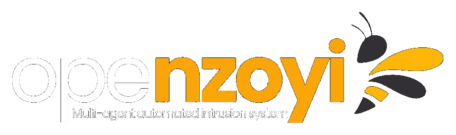

<p align="center">
  
</p>

<h1 align="center">OpenZoyi</h1>

<p align="center">
  <strong>Système multi-agents d'intrusion automatisée avec évasion adaptative des IDS</strong>
</p>

<p align="center">
  <a href="https://github.com/14juanito/Projet-Nzoyi"></a>
  <a href="https://github.com/14juanito/Projet-Nzoyi"></a>
  <a href="docs/LAB_SETUP.md"></a>
  <a href="https://github.com/14juanito/Projet-Nzoyi"></a>
</p>

---

## Présentation

**NZOYI** (*Nzoyi* signifie « abeille » en lingala) est un framework de recherche en cybersécurité offensive conçu pour évaluer la robustesse des systèmes de détection d'intrusion (IDS) modernes — notamment **Suricata** — face à un attaquant qui **apprend** à s'adapter.

Contrairement aux outils de pentest classiques, NZOYI combine :

- une **architecture multi-agents** modulaire (7 agents spécialisés),
- un **Pentest Tree (PTT)** partagé pour conserver le contexte de l'opération,
- un **Evasion Agent** basé sur le **Q-Learning** qui optimise timing, fragmentation et discrétion des scans,
- un **Evaluation Agent** qui lit le feedback des alertes IDS (Suricata `eve.json`).

> Projet de fin de cycle — Faculté des Sciences Informatiques, Université Protestante au Congo (UPC).

---

## Architecture

```
┌─────────────────────────────────────────────────────────────────┐
│                     ORCHESTRATOR AGENT                          │
│              Coordonne le pipeline de pentest                   │
└────────────────────────────┬────────────────────────────────────┘
                             │
     ┌───────────────────────┼───────────────────────┐
     ▼                       ▼                       ▼
┌─────────┐           ┌─────────────┐         ┌───────────┐
│  RECON  │──────────▶│ ENUMERATOR  │────────▶│   VULN    │
│  Agent  │           │    Agent    │         │  Analyzer │
└─────────┘           └─────────────┘         └─────┬─────┘
                                                    │
                    ┌───────────────────────────────┘
                    ▼
              ┌───────────┐    feedback     ┌─────────────┐
              │  EVASION  │◀───────────────▶│ EVALUATION  │
              │ Q-Learning│                 │  (Suricata) │
              └─────┬─────┘                 └─────────────┘
                    │
                    ▼
              ┌───────────┐
              │  ATTACK   │
              │   Agent   │
              └───────────┘

         ═══════════ Pentest Tree (PTT) ═══════════
              Mémoire partagée entre tous les agents
```

| Agent | Rôle |
|-------|------|
| **Orchestrator** | Pilote le pipeline complet |
| **Recon** | Découverte réseau et cartographie des ports |
| **Enumerator** | Fingerprinting des services |
| **Vulnerability Analyzer** | Identification des failles exploitables |
| **Evasion** | Adaptation des paramètres d'attaque via Q-Learning |
| **Attack** | Exécution des actions offensives |
| **Evaluation** | Lecture des logs IDS et mesure de détection |

---

## Environnement de lab

Le projet est conçu pour un **réseau isolé** à deux machines :

| Machine | Rôle | IP |
|---------|------|-----|
| **PC 1 — Kali Linux** | Attaquant : NZOYI, Ollama, Nmap | `192.168.100.10` |
| **PC 2 — Ubuntu Server 22.04** | Défenseur + cible : Suricata, SSH, Apache, FTP | `192.168.100.11` |

Le guide complet d'installation pas à pas est disponible dans [`docs/LAB_SETUP.md`](docs/LAB_SETUP.md).

---

## Démarrage rapide

### Prérequis

- Python 3.11+
- Kali Linux (PC attaquant)
- Ubuntu Server 22.04 + Suricata (PC cible, réseau isolé)

### Installation

```bash
git clone https://github.com/14juanito/Projet-Nzoyi.git
cd Projet-Nzoyi

python3 -m venv ~/nzoyi-env
source ~/nzoyi-env/bin/activate
pip install -r requirements.txt
```

### Tests de validation

```bash
python main.py --test
```

Résultat attendu :

```
NZOYI validation tests
========================================
  [PASS] PTT shared memory
  [PASS] Q-Learning update cycle
  [PASS] Orchestrator 7-agent pipeline
  [PASS] Stealth profile configuration
========================================
Result: 4/4 tests passed
```

### Premier lancement

```bash
# Simulation (sans trafic réseau)
python main.py --target 192.168.100.11 --profile stealth --dry-run

# Contre la cible du lab
python main.py --target 192.168.100.11 --profile stealth

# Avec feedback Suricata (eve.json)
python main.py --target 192.168.100.11 --profile stealth --eve-log /var/log/suricata/eve.json
```

### Profils d'attaque

| Profil | Timing Nmap | Délai | Fragmentation | Usage |
|--------|-------------|-------|---------------|-------|
| `stealth` | T2 | 500 ms | Oui | Évasion IDS (recommandé) |
| `default` | T3 | 0 ms | Non | Scan standard |
| `aggressive` | T4 | 0 ms | Non | Baseline comparaison |

---

## Structure du projet

```
Projet-Nzoyi/
├── assets/
│   └── openzoyi-logo.png       # Logo du projet
├── docs/
│   └── LAB_SETUP.md            # Guide d'installation du lab
├── nzoyi/
│   ├── agents/                 # 7 agents spécialisés
│   ├── core/                   # PTT, profils d'attaque
│   └── rl/                     # Q-Learning (Evasion Agent)
├── tests/
│   └── test_validation.py      # 4 tests de validation
├── main.py                     # Point d'entrée CLI
└── requirements.txt
```

---

## Hypothèses de recherche

| Hypothèse | Énoncé |
|-----------|--------|
| **H1 — Convergence** | Le Q-Learning converge vers une stratégie d'évasion stable en un nombre fini de cycles |
| **H2 — Transferabilité** | Les stratégies apprises sur Suricata sont partiellement transférables à d'autres IDS |
| **H3 — Limite défensive** | Il existe un seuil de rupture où l'évasion rend l'attaque aussi lente qu'un pentest manuel |

---

## Avertissement légal

Ce projet est destiné **exclusivement** à la recherche académique et aux tests de pénétration **autorisés** sur un réseau **isolé** que vous contrôlez.

Ne jamais utiliser NZOYI contre des systèmes sans autorisation explicite. L'auteur décline toute responsabilité en cas d'usage illégal.

---

## Auteur

**Jean El-rohi Mukendi**  
Faculté des Sciences Informatiques — Université Protestante au Congo

---

<p align="center">
  <sub>OpenZoyi v0.1.0 — Multi-agent automated intrusion system</sub>
</p>
